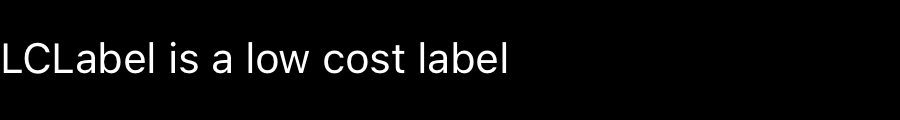
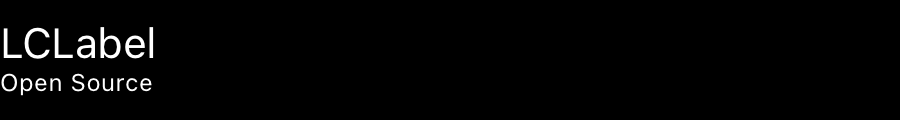
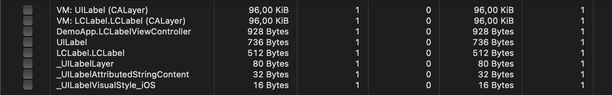
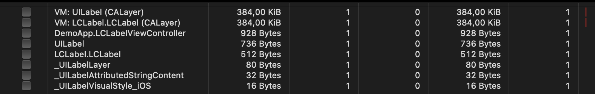
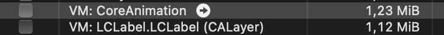

# LCLabel

[](https://codecov.io/gh/mustiikhalil/LCLabel)


LCLabel is a TextKit 2 based UILabel that mimics a the behaviour of UITextView

## Installation

### Swift Package Manager

```
File -> Swift Packages -> Add Package Dependency

Enter package URL: https://github.com/mustiikhalil/LCLabel
```

```swift
dependencies: [
  .package(
    name: "LCLabel",
    url: "https://github.com/mustiikhalil/LCLabel",
    from: "X.Y.Z"),
]
```

## How to use:

```swift
let text = NSMutableAttributedString(
  string: "welcome to this new adventure!!!",
  attributes: [:])
let range = (text.string as NSString).range(of: "welcome")
text.addAttribute(
  .lclabelLink, // Note we use type `lclabelLink`
  value: URL(string: "tel://909001")!,
  range: range)
let label = LCLabel(
  frame: CGRect(
    origin: .zero, 
    size: .init(
      width: 300, 
      height: 30)))
label.isUserInteractionEnabled = true
label.delegate = self
label.attributedText = text
view.addSubview(label)
```



or incase AutoLayout is being used

```swift
let label = LCLabel(frame: .zero)
label.isUserInteractionEnabled = true
label.delegate = self
label.attributedText = text
view.addSubview(label)
label.translatesAutoresizingMaskIntoConstraints = false
NSLayoutConstraint.activate([
  label.topAnchor.constraint(equalTo: view.topAnchor),
  label.leadingAnchor.constraint(equalTo: view.leadingAnchor),
  label.trailingAnchor.constraint(equalTo: view.trailingAnchor),
  label.bottomAnchor.constraint(equalTo: view.bottomAnchor)])
```



### Notes:

While building it with TextKit was interesting, the following nits where found:

- Setting the styles for links are usually broken. There are two solutions for this:
  1- Use type `.lclabelLink` instead of `.link` when creating your NSAttributedString

  2- Setting `linkStyleValidation` to be `.ensure` which will force the NSTextStorage to either replace all the instances of `.link` with `.lclabelLink` or takes values of `linkAttributes` and sets them to the Storage.

- `linkAttributes` would only be set if `.ensure` was set.

## Getting started

```bash
git clone https://github.com/mustiikhalil/LCLabel
cd LCLabel
open DemoApp/DemoApp.xcodeproj
// or
open package.swift
```

- `LCLabel` has three schemas to build
  1. LCLabel // Lib
  2. DemoApp // Demo app & test cases
  3. UI Full Tests // UITests that includes hitches tests
 
- `DemoApp` explains how to use LCLabel
- `DemoApp` can be ran in three modes, `-scrollview`, `-autolayout` and `default`. You will need to pass the arguments as `Arguments Passed On Launch`
- `UI Full Tests` shows that LCLabel doesnt have any hitches
  *The following was compared on an iPhone xs with a baseline of UILabel*

## Performance

#### Memory

Using UILabel as a baseline, we were able to achieve a similar performance to UILabel.

A simple text in a LCLabel would use around `96 Kib` in memory compared to UILabel.



A single line text in a LCLabel would use around `384 Kib` in memory compared to UILabel.



A single line with Emojis text in a LCLabel would use around `1.12 MiB` in memory compared to the `1.23 MiB` UILabel.



#### Scrolling

Using UILabel as a baseline, we were able to achieve a similar performance to UILabel, 
when scrolling and that was measured in the `UI Full Tests`. 
The benchmark was based on the amount of hitches detected on an iPhone XS, 
where both labels had zero hitches when scrolling a list around 5 times each time we ran the test.

## License

`LCLabel` is [MIT-licensed](./LICENSE.md).

### Disclaimer 

[UILabel](https://developer.apple.com/documentation/uikit/uilabel/) and [UITextView](https://developer.apple.com/documentation/uikit/uitextview) are Apple's own components.
